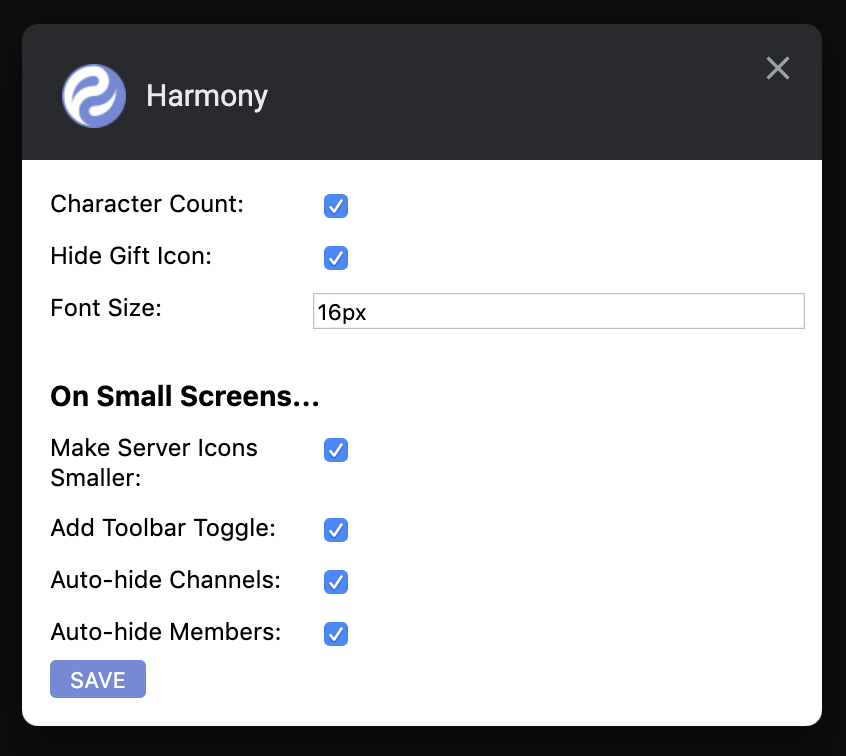

<h2 align="center">Harmony</h2>

A Chrome extension which simplifies the Discord interface and adds useful features.

    <a href="#why">Why?</a>
    ·
    <a href="#installation">Installation</a>
    ·
    <a href="#features">Features</a>
    ·
    <a href="#suggestions-and-contributions">Suggestions & Contributions</a>

## Why?

Discord is great, but has some bugs and annoyances; their team is tiny for what they've accomplished, so instead of complaining let's create a Chrome plugin which fills in the gaps until they can fix the issues for real!

No guarantees that the fixes will always work - when Discord make updates, this extension may break. If you find any bugs, please open an issue.

## Installation

Harmony is currently only available as a Chrome extension.

[Install the Chrome extension via the webstore!](https://chrome.google.com/webstore/detail/harmony/jaaoemgmljmlgmpailnhdikgbpffhkkd)

## Features

All major features are customisable via the extension's settings page. To edit these settings:

- Navigate to [chrome://extensions](chrome://extensions)
- Find the `Harmony` extension and click the associated <kbd>Details</kbd> button
- Scroll down the page and click the <kbd>Extension Options</kbd> button towards the bottom of the list
- Edit the settings in the modal
- Click the <kbd>save</kbd> button

#### Character Count

Discord messages have a 2000 character limit, but there's no way to know you've passed the limit until you click send. Harmony adds a character count to the text input, so you can split your message into multiple pieces more easily.

#### Hide Gift Icon

The gift icon next to the text input takes up valuable screen space (especially on smaller screens), and isn't particularly useful. By default, Harmony hides this icon.

#### Font Size

You can customise the font size used for channel content in the Harmony extension settings.

#### Make Server Icons Smaller

On smaller screens, the server icons take up too much space. This option scales these icons to 75% of their original size.

#### Add Toolbar Toggle

The toolbar in the channel title section also doesn't work well on smaller screen sizes, so this option hides this section behind a toggle button on smaller screens.

#### Auto-hide Channels

On smaller screens, the web interface becomes unusable. Harmony hides the channels interface, making it togglable via a new link at the top of the list of servers.

#### Auto-hide Members

The members section also takes up a lot of space and breaks the layout on smaller screens. Harmony automatically hides the members panel on small screens, both on initial load and when you resize your screen!

## Suggestions and Contributions

Suggestions and pull requests are highly encouraged!

If you have an idea for a feature, open up an [issue](https://github.com/jtmcgrath/harmony/issues). If you're interested in contributing, take a look at the [contributing guidelines](./CONTRIBUTING.md).

## License

[MIT](./LICENSE)
